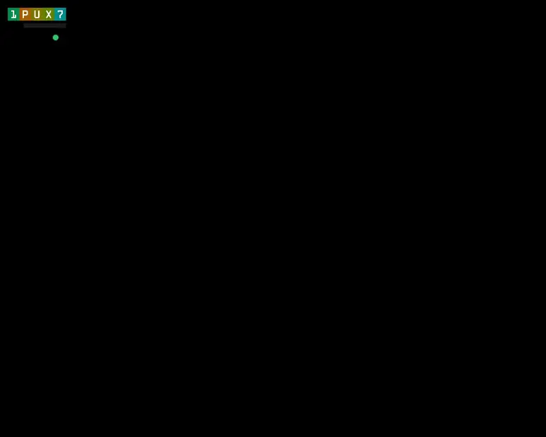
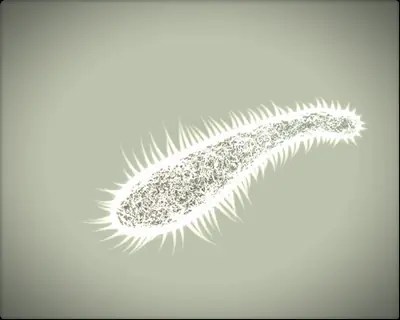
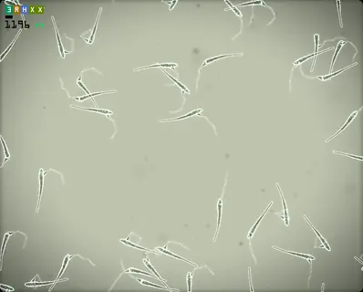
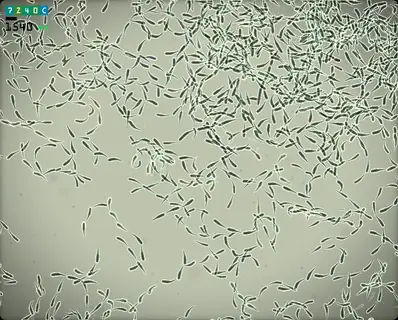
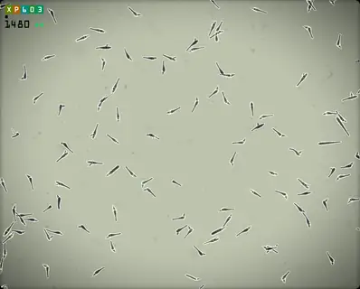
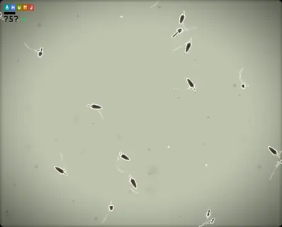
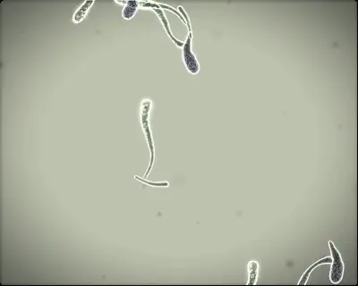

# Gene Pool



> **GenePool was created by JJ Ventrella** — possibly the most beautiful software I've ever seen. I'm delighted he published it as open source.
> JJ's site: [ventrella.com](https://www.ventrella.com) · [swimbots.com](https://swimbots.com)

The creatures are *swimbots*: little animals whose bodies, colors, and behaviors are grown from a genome. They hunt food, court mates, reproduce with crossover and mutation, drift into species, and die. Nobody designs them — you just make a world and watch what evolution does with it.

This repository is a love letter to JJ's original: a **fork** of GenePool rendered as if the pool were a **living light-microscope slide** — the swimbots as they'd look under glass — and opened up into an **arbitrary-worlds sandbox** you shape and watch evolve. Underneath, the engine is deterministic and bit-for-bit reproducible, so any run can be recorded, scrubbed, and replayed exactly.

---

## What's here

- **A light-microscope renderer** (WebGL2): translucent, backlit bodies with streaming cytoplasm, light-rimmed cilia, grain, and bloom — the swimbots as they'd look under glass.
- **Arbitrary worlds.** Pool size, walls or a wrap-around torus, obstacle fields, food ecology, lifespan, speciation strictness — all configuration, not hardcoded. JJ's original behavior is one point in that space (the default), preserved exactly.
- **A desktop app** (Electron): run a pool, scrub its whole history, record it to video, and watch its species come and go.
- **A deterministic engine** underneath it all — forked from JJ's simulation and checked against it, so the same seed gives the same world every run, on any machine. That's what makes a run recordable, scrubbable, and reproducible.

## Since the fork

JJ's GenePool is the foundation; this fork rebuilt the engine and wrapped it in new tools — while keeping JJ's original behavior exactly reproducible as the default.

**Engine & fidelity**
- Rebuilt the simulation as a **deterministic, bit-for-bit reproducible** engine, verified against JJ's original — same seed, same world, every run.
- **Cross-architecture reproducibility**, guarded by golden tests (renders match to ±1 across machines).
- Never-reused entity IDs and addressed RNG streams — retired the old fixed-slot limits, so population is unbounded.

**Rendering**
- A new WebGL2 **light-microscope renderer**: translucent backlit bodies, streaming cytoplasm, light-rimmed cilia, grain, bloom, depth — with level-of-detail and culling for large pools.

**Worlds you can build**
- Arbitrary pool size (everything scales), **walls or a wrap-around torus**, arbitrary **obstacle fields**.
- Configurable food ecology, lifespan, and speciation strictness — JJ's defaults preserved exactly.
- **Parameter schedules**: settings can change over the course of a run (drought, seasons, shifting pressure).

**New biology (opt-in, off by default)**
- An **evolvable mutation-rate gene** — lineages evolve their own mutability.
- Optional **food recovery**, so a pool eaten to zero isn't permanently dead.
- A fix for JJ's branch-category off-by-one, unlocking a quarter of the body genome.

**Persistence, playback & analysis**
- Crash-safe run recording, **scrub a run's whole history**, record to **MP4**.
- Genome-hash catalog + birth lineage; junk-DNA **species clustering** and a PCA species plate.

**Performance & tooling**
- A **parallel, multi-core** engine that runs unbounded across cores.
- An arbitrary-worlds CLI (run any world from a JSON description).

## The pool, up close

| | |
|---|---|
|  |  |
|  |  |
|  |  |

## Running it

**Desktop app** (recommended):
```sh
cd desktop
./node_modules/.bin/electron .
```

**In a browser** — open `viewer-micrograph-gl.html` (the microscope renderer) via a static server.

**Tests** (the engine's faithfulness + determinism guarantees):
```sh
node --test 'test/**/*.test.js'
```

## Origin & license

GenePool and the Swimbots were created by **Jeffrey (JJ) Ventrella** — [ventrella.com](https://www.ventrella.com) · [swimbots.com](https://swimbots.com) — and published open source. His original is included in this repository, and everything here is built on his design.

Licensed under the **MIT License with the [Commons Clause](https://commonsclause.com)** (© Jeffrey Ventrella): you may use, modify, and share it for art, education, and research — you may not sell it. See [license.md](license.md).
